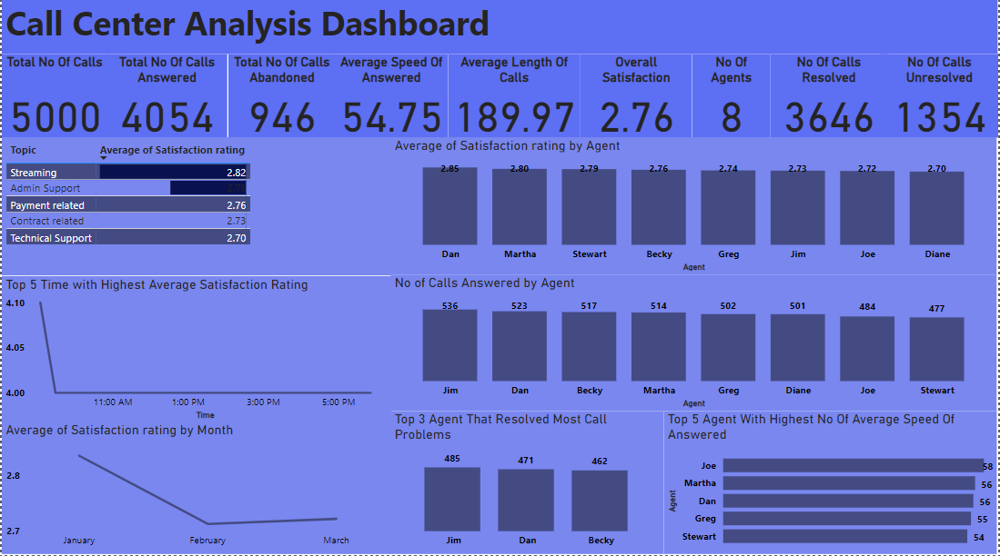

# Call Center Analysis

## Introduction
This data is about a call center,we were asked to give insight about the customer and call agent behaviour,

## PowerBi Concept Applied;
1. PowerBi Query Editor
2. DAX
   
## Problem Statement
•	Overall customer satisfaction
•	Overall calls answered/abandoned
•	Customer Satisfaction Rating per Time
•	Average speed of answer
•	Agent’s performance quadrant -> average handle time (talk duration) vs calls answered

## Data Sourcing
This data from PWC Forage Internship. The dataset is in Excel workbook format, encompassing one table, The table has 10 columns and 50000 rows,The column header are;Call Id,Agent,Date,Time,Topic,Answered (Y/N),Resolved,Speed of answer in seconds,AvgTalkDuration,Satisfaction rating

## Data Cleaning/Transformation
I used power query editor in PowerBi for the cleaning and transformation, These are the steps taken;
1. change some data type
2. Some of the time had the date/time data type
3. I change it to time alone
4. I change the Y/N in call Answered and Resolved column Yes/No
I use DAX to create the following measures;
1.  CallLengthSeconds = 
    TIMEVALUE([AvgTalkDuration]) * 3600 + 
    MINUTE([AvgTalkDuration]) * 60 + 
    SECOND([AvgTalkDuration])
2. I created a new measure,OverallSatisfaction = AVERAGE(Call_Center[Satisfaction rating])

## Data Analysis And Visualization

1. Out of 5000 total calls, 4054 were answered, and 946 were abandoned.3646 calls were resolved, while 1346 remained unresolved.
2. The average speed of answered calls is 54.75 seconds, which seems reasonable.
3. The average length of calls is 189.97 seconds, indicating the typical duration of interactions.
4. The overall satisfaction rating is 2.76, suggesting a need for improvement.
5. There are 8 agents in total, with varying levels of performance.3 agents have an average satisfaction rating higher than the overall satisfaction rating.
6. There are 5 topics of calls, with 2 topics having satisfaction ratings above the overall satisfaction rating.Streaming has a high overall rating, indicating positive customer feedback.
7. January has the highest overall rating, suggesting better customer satisfaction during this month.
8. Some agents have a higher number of resolved calls, indicating efficiency in resolving customer issues.
9. Top 5 agents with the highest number of average speed of answered calls may indicate agents who are prompt in responding to customer queries.
    
## Conclusion And Recommendation
1. Focus on enhancing overall satisfaction by addressing areas of improvement, such as resolution rates and agent performance.
2. Provide additional training and support to agents with lower satisfaction ratings to improve their performance and customer interactions.
3. Investigate topics with low satisfaction ratings and work on improving service quality and resolution times for these topics.
4. Recognize and reward agents with high resolution rates and satisfactory customer interactions to encourage continued performance.

   Conclusion:
Despite having a reasonable average speed of answered calls, there's room for improvement in overall satisfaction. Analysis of agent performance, call topics, and monthly trends provides insights into areas that require attention. By implementing targeted strategies to address these areas, such as training, topic-specific improvements, and performance recognition, the call center can enhance customer satisfaction and overall efficiency in handling customer inquiries and issues. Regular monitoring and adjustments based on feedback and analysis will be essential for ongoing improvement.
